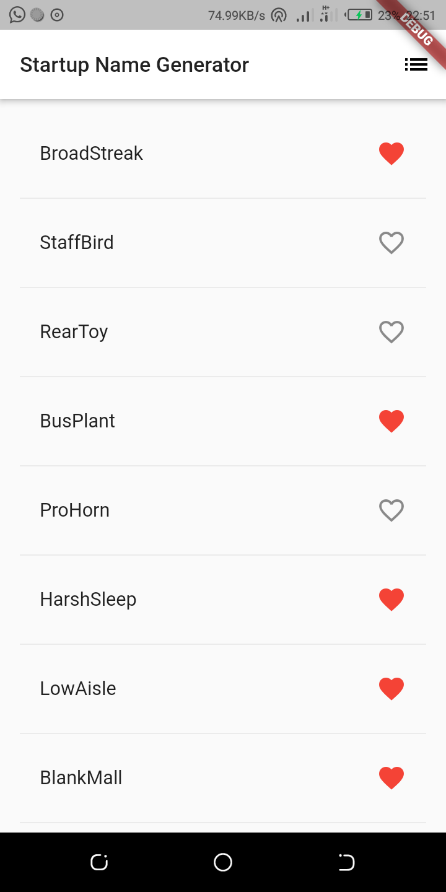
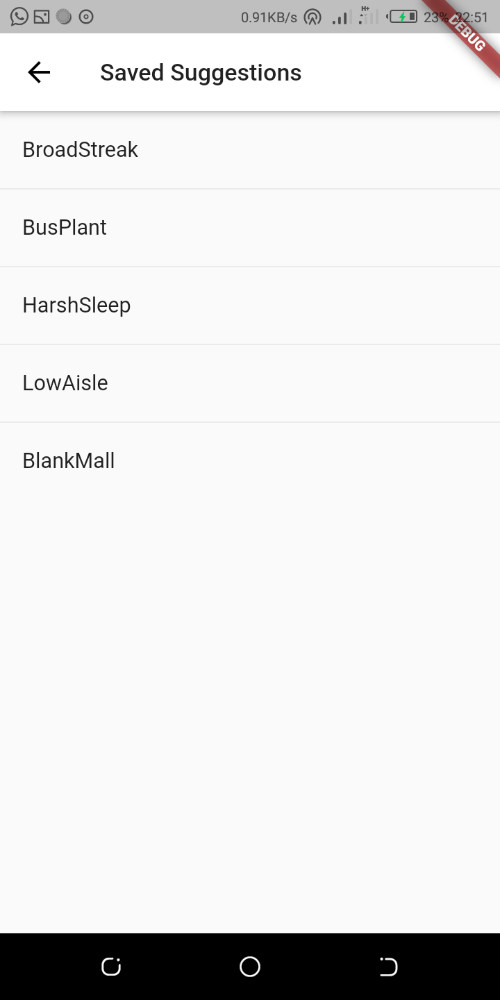

# Flutter

## 1. Name Generator (startup_name_generator)
My first interactive Flutter app that runs on both iOS and Android. From this app, I've learned:
* Writting Dart code.
* Using hot reload for a faster development cycle.
* Implementing a stateful widget, adding interactivity on the app.
* Creating a route and adding a logic for moving between the home route and the new route.
* Learned about changing the look of the app's UI using themes.
 

Above screenshots are the output
